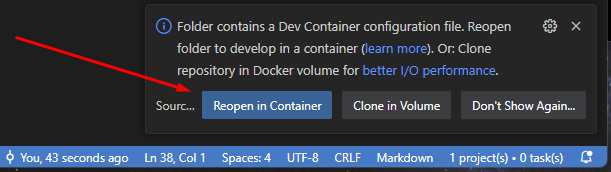
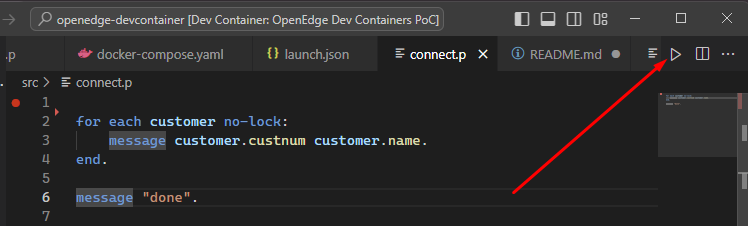

# openedge-devcontainer
VSCode devcontainer for OpenEdge Proof of Concept.

## Setup VSCode
In order for this to work just one extension needs to be installed:


## OpenEdge License
This particular setup uses OpenEdge 12.8. It's in a Docker container hosted on Docker Hub.
This is BYOL (bring your own license) and it this you just need a `progress.cfg` with a Linux 4GL Dev system in it (and whatever the requirement of the containers you add).
Put `progess.cfg` somewhere on your (host) filesystem:

For now the `mount` of the license is hardcoded in `devcontainer.json`.
```
	"mounts": [
		"source=c:/docker/license/oe-12.8/progress-128-all.cfg,target=/usr/dlc/progress.cfg,type=bind,consistency=cached"
	],
```

Note that is this repo there's a reference to the license file in `.devcontainer/docker-compose.yaml` as well.

## start
There are two routes to start. 
- Clone this repo locally and start from there
- Clone in a Docker volume

Right now we take the first route, it's easier for demonstrations. In real life you should go for option 2.

so, assuming you are IN the directory in which you want to put the clone:
```
git clone https://github.com/bfv/openedge-devcontainer.git .
```

then start VSCode: 
```
vscode . 
```

If you wait a few moments this shows up: <br/>


## running OpenEdge in the devcontainer
IN `devcontainer.json` an extra extry have been added:
```
"formulahendry.code-runner"
```
This manifests itself like:<br/>


In order for this to work this plugin needs to be set up manually for now. <br/>
This is done in `settings.json`:
```
"code-runner.executorMap": {
	"abl": "_progres -b -pf db.pf -p ${file}",
``` 
and
```
"code-runner.languageIdToFileExtensionMap": {
	"abl": [".p", ".cls"],
```
